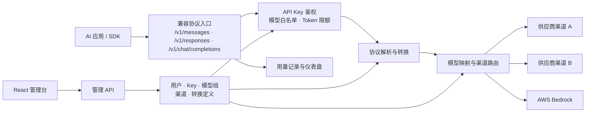

<div align="center">


# API2API

**一个入口连接多种 AI API：协议转换、智能路由、故障切换与用量治理。**

[](https://openjdk.org/)
[](https://spring.io/projects/spring-boot)
[](https://react.dev/)
[](https://www.postgresql.org/)
[](https://docs.docker.com/compose/)
[](./LICENSE)

[快速开始](#快速开始)&ensp;|&ensp;[网关调用](#网关调用)&ensp;|&ensp;[协议转换说明](./CLAUDE_MESSAGES_CONVERSION.md)&ensp;|&ensp;[许可证](./LICENSE)&ensp;|&ensp;[参与贡献](#参与贡献)

</div>

<br/>

API2API 是一个面向 AI 应用的多协议网关与管理平台。客户端可以继续使用熟悉的 Claude Messages、OpenAI Responses 或 OpenAI Chat Completions 接口，API2API 会根据配置完成鉴权、模型映射、协议转换和供应商路由，并以客户端所选协议返回结果。

它适合需要统一管理多个模型供应商、平滑迁移 SDK、提供内部 AI API 服务，或希望集中治理密钥、额度与用量的团队。

> [!NOTE]
> 项目当前处于早期开发阶段，配置结构、数据库迁移与接口细节仍可能演进。生产使用前请完成安全加固与兼容性验证。

<br/>

## 目录

- [为什么选择 API2API](#为什么选择-api2api)
- [核心能力](#核心能力)
- [支持的协议](#支持的协议)
- [快速开始](#快速开始)
- [首次配置](#首次配置)
- [网关调用](#网关调用)
- [架构概览](#架构概览)
- [技术栈](#技术栈)
- [本地开发](#本地开发)
- [生产部署](#生产部署)
- [安全建议](#安全建议)
- [参与贡献](#参与贡献)
- [许可证](#许可证)

<br/>

## 为什么选择 API2API

接入多个 AI 供应商后，应用通常需要同时处理协议差异、模型命名、密钥管理、渠道故障和用量统计。把这些逻辑散落在每个业务应用中，会让升级与迁移越来越困难。

API2API 将它们收敛为一个统一网关：

| 层面 | API2API 的作用 |
|---|---|
| **协议** | 对外暴露主流兼容接口，在网关内完成请求、响应与流式事件转换 |
| **模型** | 将客户端模型名映射到不同渠道的真实模型，并维护模型白名单 |
| **路由** | 按优先级选择可用渠道，在失败时尝试候选渠道 |
| **凭据** | 为调用方签发独立 API Key，限制可用模型与累计 Token |
| **治理** | 记录调用结果、延迟和 Token，提供用户端与管理端仪表盘 |

业务应用只依赖一个 Base URL 和一枚 API Key，供应商调整与协议适配留在网关侧完成。

<br/>

## 核心能力

### 协议与路由

- **三种客户端入口** — 兼容 Claude Messages、OpenAI Responses 和 OpenAI Chat Completions
- **协议双向转换** — 按转换定义处理消息、工具调用、推理内容、用量与流式事件
- **模型映射** — 将统一模型名映射到供应商渠道中的具体模型
- **优先级路由** — 为同一模型配置多个渠道及其优先顺序
- **故障切换** — 根据上游失败类型决定是否继续尝试候选渠道
- **流式响应** — 转发并转换 Server-Sent Events，支持首字节与空闲超时控制

### 访问与用量治理

- **独立 API Key** — 为不同用户或应用签发、禁用、删除和查看密钥
- **模型分组** — 复用模型白名单，并将分组绑定到 API Key
- **Token 限额** — 设置累计 Token 上限，阻止超额调用
- **调用记录** — 查询请求协议、模型、渠道、状态、耗时和 Token 明细
- **双层门户** — 普通用户查看自己的密钥与用量，管理员维护全局配置

### 管理与可观测性

- **供应商渠道管理** — 配置上游地址、协议、密钥引用和渠道状态
- **模型发现** — 从供应商拉取模型列表，筛选并保存渠道模型
- **转换定义浏览** — 查看协议方向、实现状态和字段映射详情
- **仪表盘** — 展示请求量、成功率、Token 趋势、协议分布和用户排行
- **用户管理** — 创建账号、调整角色与账号状态

<br/>

## 支持的协议

### 客户端入口

| 协议 | Endpoint | 鉴权方式 |
|---|---|---|
| Claude Messages | `POST /v1/messages` | `x-api-key` 或 Bearer Token |
| OpenAI Responses | `POST /v1/responses` | Bearer Token 或 `x-api-key` |
| OpenAI Chat Completions | `POST /v1/chat/completions` | Bearer Token 或 `x-api-key` |
| 模型列表 | `GET /v1/models` | Bearer Token 或 `x-api-key` |

### 上游渠道

渠道可配置为 Claude Messages、OpenAI Responses、OpenAI Chat Completions 或 AWS Bedrock Claude Messages（InvokeModel）协议。一次调用是否能够转换到目标渠道，取决于已启用的转换定义与对应能力状态。

详细的 Claude Messages 字段与兼容性说明见 [CLAUDE_MESSAGES_CONVERSION.md](./CLAUDE_MESSAGES_CONVERSION.md)。

<br/>

## 快速开始

### 前置要求

- Docker Engine
- Docker Compose v2

### 使用 Docker Compose 启动

```bash
git clone https://github.com/Jxin-Cai/api2api.git
cd api2api
cp .env.example .env
```

打开 `.env`，至少修改以下敏感配置：

```dotenv
POSTGRES_PASSWORD=replace-with-a-strong-password
ADMIN_PASSWORD=replace-with-a-strong-admin-password
API2API_API_KEY_ENCRYPTION_KEY=replace-with-a-long-random-secret
```

然后启动服务：

```bash
docker compose up -d --build
docker compose ps
```

默认访问地址：

| 服务 | 地址 |
|---|---|
| Web 管理台 | `http://localhost:8989` |
| 管理接口 | `http://localhost:8989/api/*` |
| AI 网关 | `http://localhost:8989/v1/*` |

Docker Compose 默认仅向宿主机暴露前端入口；Nginx 会把 `/api/*` 和 `/v1/*` 代理到后端。

> [!IMPORTANT]
> 示例配置仅用于本地体验。生产环境必须替换密码与加密密钥，并妥善备份 `API2API_API_KEY_ENCRYPTION_KEY`；密钥丢失后，已经加密保存的 API Key 材料将无法解密。

<br/>

## 首次配置

1. 使用 `.env` 中的 `ADMIN_USERNAME` 和 `ADMIN_PASSWORD` 登录管理台。
2. 创建供应商渠道，填写上游地址、协议和密钥引用，例如 `OPENAI_API_KEY`。
3. 将同名供应商密钥作为环境变量注入运行环境，不要在仓库中保存真实密钥。
4. 拉取或手动添加渠道模型，设置优先模型与路由顺序。
5. 创建模型分组并选择允许调用的模型。
6. 创建用户与 API Key，将模型分组和可选 Token 限额绑定到该 Key。
7. 保存首次展示的 API Key 明文；之后可在受控流程中按需查看。

供应商密钥示例：

```dotenv
OPENAI_API_KEY=replace-with-provider-secret
ANTHROPIC_API_KEY=replace-with-provider-secret
```

管理台中的渠道 `keyRef` 必须与环境变量名完全一致。

<br/>

## 网关调用

以下示例假设服务运行在 `http://localhost:8989`，并已经创建可访问 `gpt-4.1-mini` 的 API Key。

### OpenAI Chat Completions

```bash
curl http://localhost:8989/v1/chat/completions \
  -H "Authorization: Bearer YOUR_API2API_KEY" \
  -H "Content-Type: application/json" \
  -d '{
    "model": "gpt-4.1-mini",
    "messages": [
      {"role": "user", "content": "Hello from API2API"}
    ]
  }'
```

### OpenAI Responses

```bash
curl http://localhost:8989/v1/responses \
  -H "Authorization: Bearer YOUR_API2API_KEY" \
  -H "Content-Type: application/json" \
  -d '{
    "model": "gpt-4.1-mini",
    "input": "Hello from API2API"
  }'
```

### Claude Messages

```bash
curl http://localhost:8989/v1/messages \
  -H "x-api-key: YOUR_API2API_KEY" \
  -H "anthropic-version: 2023-06-01" \
  -H "Content-Type: application/json" \
  -d '{
    "model": "claude-sonnet-4-5",
    "max_tokens": 256,
    "messages": [
      {"role": "user", "content": "Hello from API2API"}
    ]
  }'
```

将现有 SDK 的 Base URL 指向 API2API，并使用 API2API 签发的 Key，即可沿用对应协议的客户端调用方式。实际可用模型由绑定到 Key 的模型分组决定。

<br/>

## 架构概览



项目采用前后端分离结构：

```text
api2api/
├── backend/                  # Spring Boot 后端
│   └── src/main/
│       ├── java/             # 领域、应用、基础设施与 HTTP 接口
│       └── resources/
│           └── db/migration/ # Flyway 数据库迁移
├── frontend/                 # React + Vite 管理台
├── .github/workflows/        # CI/CD 工作流
├── docker-compose.yml        # 一体化部署
└── README.md
```

<br/>

## 技术栈

| 层面 | 技术 |
|---|---|
| Backend | Java 17、Spring Boot 3.3、Spring MVC、JDBC、MapStruct |
| Frontend | React 19、TypeScript、Vite、Ant Design、TanStack Query、Zustand |
| Database | PostgreSQL 16、Flyway |
| Gateway | Nginx、Server-Sent Events |
| Delivery | Docker Compose、GitHub Actions |

<br/>

## 本地开发

### 环境要求

- JDK 17+
- Maven 3.6.3+
- Node.js 20+
- PostgreSQL 16

### 后端

```bash
cp backend/.env.example backend/.env
cd backend
mvn spring-boot:run
```

后端默认监听 `http://localhost:8080`。启动前请将 `backend/.env` 中的密码与 API Key 加密密钥替换为本地安全值，并确保这些变量已经导入当前进程环境。

运行测试：

```bash
cd backend
mvn test
```

### 前端

```bash
cd frontend
cp .env.example .env
npm ci
npm run dev
```

前端开发服务器默认使用 Vite 地址。当前后端分开运行时，将 `VITE_API_BASE_URL` 设置为 `http://localhost:8080`。

检查类型并构建：

```bash
cd frontend
npm run typecheck
npm run build
```

<br/>

## 生产部署

仓库内置 [Deploy production](./.github/workflows/deploy.yml) 工作流：

- push 到 `master` 时自动部署
- 支持在 GitHub Actions 页面手动触发
- 通过 SSH 在目标服务器拉取代码并运行 Docker Compose
- 普通参数使用 Repository Variables，密码、SSH 私钥和供应商密钥使用 Repository Secrets

部署前需要配置服务器地址、用户、端口、部署目录、分支和 SSH host key，并提供数据库密码、管理员密码与部署私钥。供应商密钥和 `API2API_API_KEY_ENCRYPTION_KEY` 可通过多行 `PROVIDER_SECRET_ENV` Secret 注入。

如果不使用 GitHub Actions，也可以在服务器上直接执行：

```bash
git pull --ff-only
docker compose --env-file .env -p api2api up -d --build --remove-orphans
docker compose --env-file .env -p api2api ps
```

<br/>

## 安全建议

- 不要提交 `.env`、供应商 Token、API Key、数据库密码或 SSH 私钥
- 生产环境必须更换默认管理员密码、数据库密码和 API Key 加密密钥
- 使用 HTTPS 反向代理对外提供服务，并限制管理端入口的网络访问
- 为不同应用签发独立 API Key，配置最小模型权限和合理的 Token 上限
- 定期轮换管理员凭据与供应商密钥，并审查异常调用记录
- 报告安全问题时请勿在公开 Issue 中附带可利用细节或任何真实凭据

<br/>

## 参与贡献

欢迎提交 Issue 和 Pull Request。

1. Fork 仓库并从 `master` 创建功能分支
2. 保持改动聚焦，并为新增行为补充测试
3. 后端运行 `mvn test`
4. 前端运行 `npm run typecheck` 和 `npm run build`
5. 在 Pull Request 中说明动机、实现方式、验证结果与兼容性影响

提交代码前，请确保日志不包含 Token、密钥或密码，敏感配置只通过环境变量注入。

<br/>

## 许可证

本项目采用 [Apache License 2.0](./LICENSE)。

Copyright 2026 jxin
